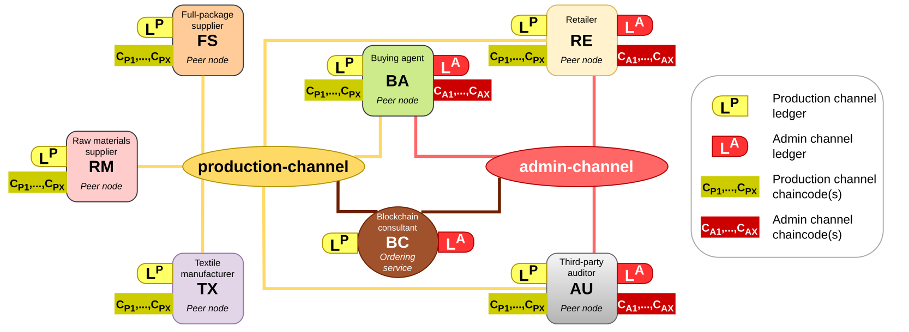
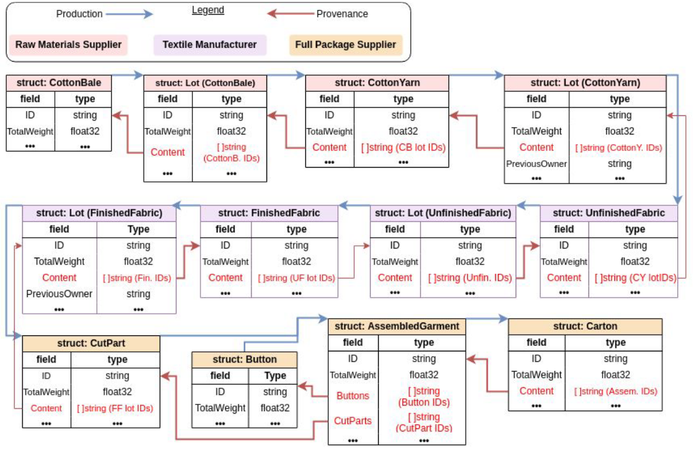

<a id="readme-top"></a>

<!-- PROJECT LOGO -->
<br />
<div align="center">
    
    <p align="center">
    Generated by DALL·E 3

  <h3 align="center">Enhancing transparency in buyer-driven commodity chains for complex products: a blockchain-based traceability framework demonstrated through an apparel supply chain simulation</h3>

  <p align="center">
    This repository contains the chaincodes and scripts necessary to simulate the cotton-to-shirt trace discussed in Section 3 of the paper.
    <br />
    <a href="abour:blank"><strong>Read the paper»</strong></a> (link not yet available)
  </p>
</div>

<!-- TABLE OF CONTENTS -->
<details>
  <summary>Table of Contents</summary>
  <ol>
    <li>
      <a href="#abstract">Abstract</a>
    </li>
    <li>
      <a href="#getting-started">Getting Started</a>
      <ul>
        <li><a href="#built-with">Built With</a></li>
        <li><a href="#prerequisites">Prerequisites</a></li>
        <li><a href="#installation">Installation</a></li>
      </ul>
    </li>
    <li><a href="#usage">Usage</a></li>
        <ul>
        <li><a href="#admin-channel-trace">Generating the admin-channel trace</a></li>
        <li><a href="#production-channel-trace">Generating the production-channel trace</a></li>
      </ul>
    </li>
    <li><a href="#citation">Citation</a></li>
    <li><a href="#contributing">Contributing</a></li>
    <li><a href="#license">License</a></li>
    <li><a href="#contact">Contact</a></li>
  </ol>
</details>


<!-- ABOUT THE PROJECT -->
## Abstract
*From the paper:*
Buyer-driven commodity chains are characterized by commercial relationships between buyers and sellers that may obscure accountability due to complexity, thereby undermining sustainability efforts. Conventional methods to trace production, including ineffective human-led audits, risk reorienting global corporate governance towards the interests of private business and away from social benefit by limiting the role of objective data in the process. This study examines the relevant features of private, permissioned blockchain towards harnessing the transparency challenge by demonstrating the efficacy of our proposed framework against a simulation of a real-world multi-tier apparel supply chain. The simulation integrates a set of functional and operational requirements achieved through a combination of programmable smart contracts and underlying blockchain architecture. We then evaluate the framework both qualitatively and quantitatively before discussing the limitations of our work.

<p align="right">(<a href="#readme-top">back to top</a>)</p>

<!-- GETTING STARTED -->
## Getting Started

<!-- BUILT WITH -->
### Built With

* [Hyperledger Fabric](https://github.com/hyperledger/fabric) version [2.5.9](https://github.com/hyperledger/fabric/releases/tag/v2.5.9)
* [Go](https://github.com/golang/go) version [1.22.4](https://github.com/golang/go/releases/tag/go1.22.4)
* [jq](https://github.com/jqlang/jq) version [1.6](https://github.com/jqlang/jq/releases/tag/jq-1.6)
* [Docker Desktop](https://www.docker.com/products/docker-desktop/) 

<!-- PREREQUISITES -->
### Prerequisites

Please follow the detailed instructions on the Hyperledger Fabric website to install the necessary prerequisites (including those listed above) required to run a local Docker-based Fabric network based on your operating system:
* [macOS](https://hyperledger-fabric.readthedocs.io/en/release-2.5/prereqs.html#mac)
* [Linux](https://hyperledger-fabric.readthedocs.io/en/release-2.5/prereqs.html#linux)
* [Windows](https://hyperledger-fabric.readthedocs.io/en/release-2.5/prereqs.html#windows)
  * For Windows: it is strongly recommended to use WSL2 (Windows Subsystem for Linux version 2) and thereon follow the [Linux](https://hyperledger-fabric.readthedocs.io/en/release-2.5/prereqs.html#linux) instructions


<!-- INSTALLATION -->
### Installation

In order to use this repository to simulate an apparel supply chain trace, one must:
1. Clone this repository and navigate there to make it the working directory for the following steps
2. Download the Fabric install script and make it (and all existing scripts) executable:
   ```
   curl -sSLO https://raw.githubusercontent.com/hyperledger/fabric/main/scripts/install-fabric.sh && find . -type f -name "*.sh" -exec chmod +x {} \;
   ```
3. Use this newly installed script to download the v2.5.9 binaries:
   ```
   ./install-fabric.sh --fabric-version 2.5.9 binary
   ```
   If executed succesfully, this will create 2 directories within the working directory: ``bin/`` and ``builders/`` 
4. Navigate to the admin-channel chaincode directory, i.e., ``chaincode/admin-channel/``, and create the ``vendor/`` directory:
   ```
   go mod vendor
   ```
   Then, do the same for the production-channel chaincode directory, i.e., ``chaincode/production-channel/``. At the end of this step, both ``admin-channel/`` and ``production-channel/`` should contain a ``vendor`` directory.

<p align="right">(<a href="#readme-top">back to top</a>)</p>


<!-- USAGE -->
## Usage

Now that the prerequisites and go dependencies for the chaincode are installed, we can begin the simulation. As discussed in the paper, the network topology comprises 2 separate channels for administrative reasons:
<div align="center">
    
</div>
Consequently: the chaincode(s), the ledger, and ultimately, the trace, are unique to each channel. The admin-channel trace contains higher-level transactions, like purchase order generation and proposals to add upstream factories to fulfill the manufacturing tasks. The production-channel trace provides a low-level view of the actual manufacturing tasks to fulfill the 200 shirts order placed in the admin-channel. Let us start with generating the admin-channel trace:

<!-- ADMIN-CHANNEL -->
### Admin-channel trace

1. Navigate to the test-network directory, i.e., ``cd test-network/`` 
2. Ensure that the necessary Fabric binaries are accessible in your PATH and that important functions are, too:
   ```
   export PATH=${PWD}/../bin:$PATH && export FABRIC_CFG_PATH=$PWD/../config/ && source ./scripts/envVar.sh
   ```
3. Start the network from a known initial state:
   ```
   ./network.sh down
   ```
4. Start the necessary containers and join them to the admin-channel:
   ```
   ./networkSetup.sh
   ```
5. Package and deploy the admin-channel chaincode(s) and generate the trace as discussed in Section 4.3 of the paper:
   ```
   ./initAdminLedger.sh
   ```

<!-- PRODUCTION-CHANNEL -->
### Production-channel trace
1. Navigate to the test-network directory, i.e., ``cd test-network/`` 
2. Ensure that the necessary Fabric binaries are accessible in your PATH and that important functions are, too:
   ```
    export PATH=${PWD}/../bin:$PATH && export FABRIC_CFG_PATH=$PWD/../config/ && source ./scripts/envVar.sh
   ```
3. Optional: Start the network from a known initial state:
   ```
   ./network.sh down
   ```
   _You may choose to skip this step and keep the network running if all that has been done is generating the admin-channel trace._
4. Start the necessary containers and join them to the production-channel:
   ```
   ./networkSetup.sh 1
   ```
   _By adding a 1 to the execution, the script creates and runs the remaining containers that were unnecessary for generating the admin-channel trace, i.e., org4 (RM), org5 (TX), and org6 (FS)._
5. Package and deploy the production-channel chaincode(s) and generate the trace as discussed in Section 4.4 of the paper and shown below:
   ```
   ./initProductionLedger_${ORDER_QUANTITY}.sh
   ```
   _Running ``initProductionLedger_${ORDER_QUANTITY}.sh`` will take significantly longer than ``initAdminLedger.sh`` given the deployment of more complex chaincode(s) and increased function invocations due to the requirements of a production-grade trace... Obviously, ${ORDER_QUANTITY} also determines how long the simulation will take to run!_
<div align="center">
    
</div>

<p align="right">(<a href="#readme-top">back to top</a>)</p>


<!-- CITATION -->
## Citation

Incoming...

<!-- CONTRIBUTING -->
## Contributing

Contributions are what make the open source community such an amazing place to learn, inspire, and create. Any contributions you make are **greatly appreciated**.

If you have a suggestion that would make this better, please fork the repo and create a pull request. You can also simply open an issue with the tag "enhancement".
Don't forget to give the project a star! Thanks again!

1. Fork the Project
2. Create your Feature Branch (`git checkout -b feature/AmazingFeature`)
3. Commit your Changes (`git commit -m 'Add some AmazingFeature'`)
4. Push to the Branch (`git push origin feature/AmazingFeature`)
5. Open a Pull Request

<p align="right">(<a href="#readme-top">back to top</a>)</p>


<!-- LICENSE -->
## License

Distributed under the Apache-2.0 license. See `LICENSE.txt` for more information.

<p align="right">(<a href="#readme-top">back to top</a>)</p>


<!-- CONTACT -->
## Contact

Ritwik Takkar - rt398@cornell.edu

Project Link: [https://github.com/ritwiktakkar/ism_WEave](https://github.com/ritwiktakkar/ism_WEave)

<p align="right">(<a href="#readme-top">back to top</a>)</p>

